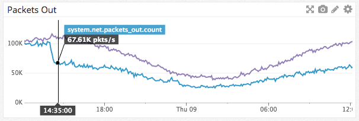

# Manifold

[](https://travis-ci.org/discordapp/manifold)
[](https://hex.pm/packages/manifold)

Erlang and Elixir make it very easy to send messages between processes even across the network, but there are a few pitfalls.

- Sending a message to many PIDs across the network also copies the message across the network that many times.
- Send calls cost about 70 µs/op so doing them in a loop eventually gets too expensive.

[Discord](https://discordapp.com) runs a single `GenServer` per Discord server and some of these have over 30,000 PIDs connected
to them from many different Erlang nodes. Increasingly we noticed some of them getting behind on processing their message queues
and the culprit was the cost of 70 µs per `send/2` call multiplied by connected sessions. How could we solve this?

Inspired by a [blog post](http://www.ostinelli.net/boost-message-passing-between-erlang-nodes/) about boosting performance of
message passing between nodes, Manifold was born. Manifold distributes the work of sending messages to the remote nodes of the
PIDs, which guarantees that the sending processes at most only calls `send/2` equal to the number of involved remote nodes.
Manifold does this by first grouping PIDs by their remote node and then sending to `Manifold.Partitioner` on each of those nodes.
The partitioner then consistently hashes the PIDs using `:erlang.phash2/2`, groups them by number of cores, sends to child
workers, and finally those workers send to the actual PIDs. This ensures the partitioner does not get overloaded and still provides
the linearizability guaranteed by `send/2`.

The results were great! We observed packets/sec drop by half immediately after deploying. The Discord servers in question also
were finally able to keep up with their message queues.



## Usage

Add it to `mix.exs`

```elixir
defp deps do
  [{:manifold, "~> 1.0"}]
end
```

Then just use it like the normal `send/2` except it can also take a list of PIDs.

```elixir
Manifold.send(self(), :hello)
Manifold.send([self(), self()], :hello)
```

### Configuration
Manifold takes a single configuration option, which sets the module it dispatches to to actually call send. The default
is GenServer. To set this variable, add the following to your `config.exs`:

```elixir
config :manifold, gen_module: MyGenModule
```

In the above instance, `MyGenModule` must define a `send/2` function that matches the types of `GenServer.send`.


## License

Manifold is released under [the MIT License](LICENSE).
Check [LICENSE](LICENSE) file for more information.
